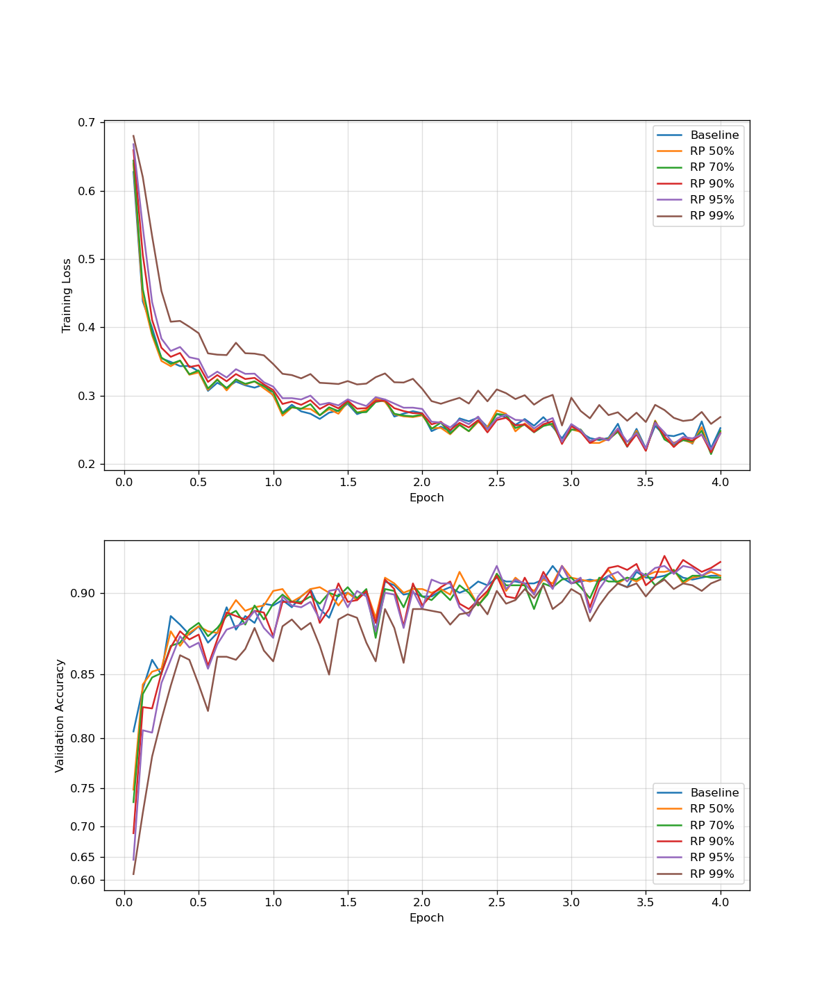

# ReSprop-T

*Reuse Sparsified Backpropagation for Transformers*,
or ReSprop-T for short,
is a proof-of-concept demonstration of applying the ideas originally proposed in the [ReSprop paper](https://openaccess.thecvf.com/content_CVPR_2020/papers/Goli_ReSprop_Reuse_Sparsified_Backpropagation_CVPR_2020_paper.pdf) to the training of transformer architectures.


## Usage
The `ReSpropLinear` layer works just like a regular `Linear` torch layer,
with the addition of the `reuse_percentage` parameter to specify the gradient reuse percentage / sparsity.

For Bert models, we also support automatic respropification using the `resprofify_bert` function:

```python
from resprop_linear import resprofify_bert
from transformers import AutoModel

model = AutoModel("bert-base-uncased")
model = resprofify_bert(model, reuse_percentage=0.9)
```

> **Attention:**
> The provided implementation of the `ReSpropLinear` layer only serves to demonstrate that one can reuse gradients during training, without taking advantage of the sparsity.
> Consequently, backpropagation is actually slower when using it.


## Run Experiments
We provide a simple experiment that fine-tunes a [tiny-bert](https://huggingface.co/prajjwal1/bert-tiny) model on the [Yelp polarity dataset](https://huggingface.co/datasets/fancyzhx/yelp_polarity) for sentiment classification using different levels of gradient reuse.


We recommend you use [pixi](http://pixi.sh) to set up the environment and run the experiment.

```bash
pixi install
pixi run python experiment.py
```

Alternatively, you can also set up your environment manually.

```bash
pip install torch==2.5.1 transformers==4.46.3 accelerate==1.1.1 scikit-learn==1.5.2 matplotlib==3.9.2 datasets==3.1.0 evaluate==0.4.3
python experiment.py
```

Depending on your hardware, this will probably take a few hours to run,
at the end of which a file called `result.png` should be generated,
showing both a loss vs. epoch vs. reuse percentage, as well as an accuracy vs. epoch vs. reuse percentage graph.
